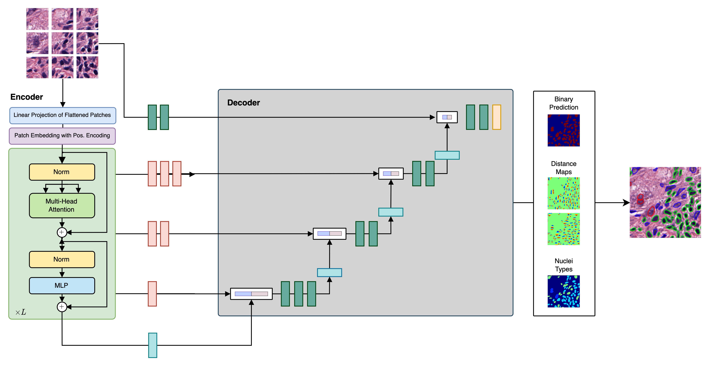

[](https://www.python.org/downloads/release/python-360/)
[](https://github.com/psf/black)
[](./reports/flake8/index.html)
[](https://www.codefactor.io/repository/github/tio-ikim/cellvit)
</a>
[](https://visitorbadge.io/status?path=https%3A%2F%2Fgithub.com%2FTIO-IKIM%2FCellViT)
[](https://paperswithcode.com/sota/panoptic-segmentation-on-pannuke?p=cellvit-vision-transformers-for-precise-cell)
___
<p align="center">
  
</p>

___

# CellViT: Vision Transformers for Precise Cell Segmentation and Classification
<div align="center">

[Key Features](#key-features) • [Installation](#installation) • [Usage](#usage) • [Training](#training) • [Inference](#inference) • [Examples](#examples) • [Roadmap](#Roadmap) • [Citation](#Citation)

</div>

---

> **Update 08.08.2023**:
>
> :bangbang: We fixed a severe training bug and uploaded new checkpoints. Please make sure to pull all changes and redownload your CellViT checkpoints to get the best results :bangbang:
>
> :ballot_box_with_check: Improved reproducability by providing config and log files for best models (CellViT-SAM-H and CellViT-256) and adopted PanNuke inference script for an easier evaluation
>
> :ballot_box_with_check: Inference speed improved by x100 for postprocessing, added new preprocessing with CuCIM speedup
>
> :ballot_box_with_check: Fixed bug in postprocessing that may insert doubled cells during cell-detection
>
> :ballot_box_with_check: Added batch-size and mixed-precision options to inference cli to support RAM limited GPUs
>
> :ballot_box_with_check: Extended configuration and added sweep configuration
---

*Hörst, F., Rempe, M., Heine, L., Seibold, C., Keyl, J., Baldini, G., Ugurel, S., Siveke, J., Grünwald, B., Egger, J., & Kleesiek, J. (2023). CellViT: Vision Transformers for precise cell segmentation and classification. https://doi.org/10.48550/ARXIV.2306.15350*

This repository contains the code implementation of CellViT, a deep learning-based method for automated instance segmentation of cell nuclei in digitized tissue samples. CellViT utilizes a Vision Transformer architecture and achieves state-of-the-art performance on the [PanNuke](https://warwick.ac.uk/fac/cross_fac/tia/data/pannuke) dataset, a challenging nuclei instance segmentation benchmark.

> **If you intend to use anything from this repo, citation of the original publication given above is necessary**


<p align="center">
  
</p>


## Key Features
  - State-of-the-Art Performance: CellViT outperforms existing methods for nuclei instance segmentation by a substantial margin, delivering superior results on the PanNuke dataset:
    - Mean panoptic quality: 0.51
    - F1-detection score: 0.83
  - Vision Transformer Encoder: The project incorporates pre-trained Vision Transformer (ViT) encoders, which are known for their effectiveness in various computer vision tasks. This choice enhances the segmentation performance of CellViT.
  - U-Net Architecture: CellViT adopts a U-Net-shaped encoder-decoder network structure, allowing for efficient and accurate nuclei instance segmentation. The network architecture facilitates both high-level and low-level feature extraction for improved segmentation results.
  - Weighted Sampling Strategy: To enhance the performance of CellViT, a novel weighted sampling strategy is introduced. This strategy improves the representation of challenging nuclei instances, leading to more accurate segmentation results.
  - Fast Inference on Gigapixel WSI: The framework provides fast inference results by utilizing a large inference patch size of $1024 \times 1024$ pixels, in contrast to the conventional $256$-pixel-sized patches. This approach enables efficient analysis of Gigapixel Whole Slide Images (WSI) and generates localizable deep features that hold potential value for downstream tasks. We provide a fast inference pipeline with connection to current Viewing Software such as *QuPath*


#### Visualization
<div align="center">


</div>


## Installation

1. Clone the repository:
  `git clone https://github.com/TIO-IKIM/CellViT.git`
2. Create a conda environment with Python 3.9.7 version and install conda requirements: `conda env create -f environment.yml`. You can change the environment name by editing the `name` tag in the environment.yaml file.
This step is necessary, as we need to install `Openslide` with binary files. This is easier with conda. Otherwise, installation from [source](https://openslide.org/api/python/) needs to be performed and packages installed with pi
3. Activate environment: `conda activate cellvit_env`
4. Install torch (>=2.0) for your system, as described [here](https://pytorch.org/get-started/locally/). Preferred version is 2.0, see [optional_dependencies](./optional_dependencies.txt) for help. You can find all version here: https://pytorch.org/get-started/previous-versions/

5. Install optional dependencies `pip install -r optional_dependencies.txt` to get a speedup using [NVIDIA-Clara](https://www.nvidia.com/de-de/clara/) and [CuCIM](https://github.com/rapidsai/cucim) for preprocessing during inference. Please select your CUDA versions. Help for installing cucim can be found [online](https://github.com/rapidsai/cucim).
**Note Error: cannot import name CuImage from cucim**
If you get this error, install cucim from conda to get all binary files.
First remove your previous dependeny with `pip uninstall cupy-cuda117` and reinstall with `
conda install -c rapidsai cucim` inside your conda environment. This process is time consuming, so you should be patient. Also follow their [official guideline](https://github.com/rapidsai/cucim).

### FAQ: Environment problems

**ResolvePackageNotFound: -gcc**

- Fix: Comment out the gcc package in the environment.yml file

**ResolvePackageNotFound: -libtiff==4.5.0=h6adf6a1_2, -openslide==3.4.1=h7773abc_6**

- Fix: Remove the version hash from environment.yml file, such that:
  ```yaml
  ...
  dependencies:
    ...
    - libtiff=4.5.0
    - openslide=3.4.1
  
  pip:
  ...
  ```

**PyDantic Validation Errors for the CLI**

Please install the pydantic version specified (`pydantic==1.10.4`), otherwise validation errors could occur for the CLI.

## Usage:

### Project Structure

We are currently using the following folder structure:

```bash
├── base_ml               # Basic Machine Learning Code: CLI, Trainer, Experiment, ...
├── cell_segmentation     # Cell Segmentation training and inference files
│   ├── datasets          # Datasets (PyTorch)
│   ├── experiments       # Specific Experiment Code for different experiments
│   ├── inference         # Inference code for experiment statistics and plots
│   ├── trainer           # Trainer functions to train networks
│   ├── utils             # Utils code
│   └── run_xxx.py        # Run file to start an experiment
├── configs               # Config files
│   ├── examples          # Example config files with explanations
│   └── python            # Python configuration file for global Python settings
├── datamodel             # Datamodels of WSI, Patientes etc. (not ML specific)
├── docs                  # Documentation files (in addition to this main README.md)
├── models                # Machine Learning Models (PyTorch implementations)
│   ├── encoders          # Encoder networks (see ML structure below)
│   ├── pretrained        # Checkpoint of important pretrained models (needs to be downloaded from Google drive)
│   └── segmentation      # CellViT Code
├── preprocessing         # Preprocessing code
│   └── patch_extraction  # Code to extract patches from WSI
```


### Training
The CLI for a ML-experiment to train the CellViT-Network is as follows (here the [```run_cellvit.py```](cell_segmentation/run_cellvit.py) script is used):
```bash
usage: run_cellvit.py [-h] --config CONFIG [--gpu GPU] [--sweep | --agent AGENT | --checkpoint CHECKPOINT]

Start an experiment with given configuration file.

optional arguments:
  -h, --help            show this help message and exit
  --gpu GPU             Cuda-GPU ID (default: None)
  --sweep               Starting a sweep. For this the configuration file must be structured according to WandB sweeping. Compare
                        https://docs.wandb.ai/guides/sweeps and https://community.wandb.ai/t/nested-sweep-configuration/3369/3 for further
                        information. This parameter cannot be set in the config file! (default: False)
  --agent AGENT         Add a new agent to the sweep. Please pass the sweep ID as argument in the way entity/project/sweep_id, e.g.,
                        user1/test_project/v4hwbijh. The agent configuration can be found in the WandB dashboard for the running sweep in
                        the sweep overview tab under launch agent. Just paste the entity/project/sweep_id given there. The provided config
                        file must be a sweep config file.This parameter cannot be set in the config file! (default: None)
  --checkpoint CHECKPOINT
                        Path to a PyTorch checkpoint file. The file is loaded and continued to train with the provided settings. If this is
                        passed, no sweeps are possible. This parameter cannot be set in the config file! (default: None)

required named arguments:
  --config CONFIG       Path to a config file (default: None)
```

The important file is the configuration file, in which all paths are set, the model configuration is given and the hyperparameters or sweeps are defined. For each specific run file, there exists an example file in the [`./configs/examples/cell_segmentation`](configs/examples/cell_segmentation) folder with the same naming as well as a configuration file that explains how to run WandB sweeps for hyperparameter search. All metrics defined in your trainer are logged to WandB. The WandB configuration needs to be set up in the configuration file, but also turned off by the user.

An example config file is given [here](configs/examples/cell_segmentation/train_cellvit.yaml) with explanations [here](docs/readmes/example_train_config.md).
For sweeps, we provide a sweep example file [`train_cellvit_sweep.yaml`](/configs/examples/cell_segmentation/train_cellvit_sweep.yaml).

**Pre-trained ViT models** for training initialization can be downloaded from Google Drive: [ViT-Models](https://drive.google.com/drive/folders/1zFO4bgo7yvjT9rCJi_6Mt6_07wfr0CKU?usp=sharing). Please check out the corresponding licenses before distribution and further usage! Note: We just used the teacher models for ViT-256.

:exclamation: If your training crashes at some point, you can continue from a checkpoint


#### Dataset preparation
We use a customized dataset structure for the PanNuke and the MoNuSeg dataset.
The dataset structures are explained in [pannuke.md](docs/readmes/pannuke.md) and [monuseg.md](docs/readmes/monuseg.md) documentation files.
We also provide preparation scripts in the [`cell_segmentation/datasets/`](cell_segmentation/datasets/) folder.

#### Evaluation
In our paper, we did not (!) use early stopping, but rather train all models for 130 to eliminate selection bias but have the largest possible database for training. Therefore, evaluation neeeds to be performed with the `latest_checkpoint.pth` model and not the best early stopping model.
We provide to script to create evaluation results: [`inference_cellvit_experiment.py`](cell_segmentation/inference/inference_cellvit_experiment.py) for PanNuke and [`inference_cellvit_monuseg.py`](cell_segmentation/inference/inference_cellvit_monuseg.py) for MoNuSeg.

> :exclamation: We recently adapted the evaluation code and added a tag to the config files to select which checkpoint needs to be used. Please make sure to use the right checkpoint and select the appropriate dataset magnification.

### Inference

Model checkpoints can be downloaded here:

- [CellViT-SAM-H](https://drive.google.com/uc?export=download&id=1MvRKNzDW2eHbQb5rAgTEp6s2zAXHixRV) 🚀
- [CellViT-256](https://drive.google.com/uc?export=download&id=1tVYAapUo1Xt8QgCN22Ne1urbbCZkah8q)
- [CellViT-SAM-H-x20](https://drive.google.com/uc?export=download&id=1wP4WhHLNwyJv97AK42pWK8kPoWlrqi30)
- [CellViT-256-x20](https://drive.google.com/uc?export=download&id=1w99U4sxDQgOSuiHMyvS_NYBiz6ozolN2)

License: [Apache 2.0 with Commons Clause](./LICENSE)

Proved checkpoints have been trained on 90% of the data from all folds with the settings described in the publication.

##### Steps
The following steps are necessary for preprocessing:
1. Prepare WSI with our preprocessing pipeline
2. Run inference with the [`inference/cell_detection.py`](/cell_segmentation/inference/cell_detection.py) script

Results are stored at preprocessing locations

#### 1. Preprocessing
In our Pre-Processing pipeline, we are able to extract quadratic patches from detected tissue areas, load annotation files (`.json`) and apply color normlizations. We make use of the popular [OpenSlide](https://openslide.org/) library, but extended it with the [RAPIDS cuCIM](https://github.com/rapidsai/cucim) framework for an x8 speedup in patch-extraction. The documentation for the preprocessing can be found [here](/docs/readmes/preprocessing.md).

Preprocessing is necessary to extract patches for our inference pipeline. We use squared patches of size 1024 pixels with an overlap of 64 px.

**Please make sure that you select the following properties for our CellViT inference**
| Parameter     	| Value 	|
|---------------	|-------	|
| patch_size    	| 1024  	|
| patch_overlap 	| 6.25  	|

#### Resulting Dataset Structure
In general, the folder structure for a preprocessed dataset looks like this:
The aim of pre-processing is to create one dataset per WSI in the following structure:
```bash
WSI_Name
├── annotation_masks      # thumbnails of extracted annotation masks
│   ├── all_overlaid.png  # all with same dimension as the thumbnail
│   ├── tumor.png
│   └── ...  
├── context               # context patches, if extracted
│   ├── 2                 # subfolder for each scale
│   │   ├── WSI_Name_row1_col1_context_2.png
│   │   ├── WSI_Name_row2_col1_context_2.png
│   │   └── ...
│   └── 4
│   │   ├── WSI_Name_row1_col1_context_2.png
│   │   ├── WSI_Name_row2_col1_context_2.png
│   │   └── ...
├── masks                 # Mask (numpy) files for each patch -> optional folder for segmentation
│   ├── WSI_Name_row1_col1.npy
│   ├── WSI_Name_row2_col1.npy
│   └── ...
├── metadata              # Metadata files for each patch
│   ├── WSI_Name_row1_col1.yaml
│   ├── WSI_Name_row2_col1.yaml
│   └── ...
├── patches               # Patches as .png files
│   ├── WSI_Name_row1_col1.png
│   ├── WSI_Name_row2_col1.png
│   └── ...
├── thumbnails            # Different kind of thumbnails
│   ├── thumbnail_mpp_5.png
│   ├── thumbnail_downsample_32.png
│   └── ...
├── tissue_masks          # Tissue mask images for checking
│   ├── mask.png          # all with same dimension as the thumbnail
│   ├── mask_nogrid.png
│   └── tissue_grid.png
├── mask.png              # tissue mask with green grid  
├── metadata.yaml         # WSI metdata for patch extraction
├── patch_metadata.json   # Patch metadata of WSI merged in one file
└── thumbnail.png         # WSI thumbnail
```

The cell detection and segmentation results are stored in a newly created `cell_detection` folder for each WSI.

#### 2. Cell detection script
If the data is prepared, use the [`cell_detection.py`](inference/cell_detection.py) script inside the `cell_segmentation/inference` folder to perform inference:

```bash
usage: cell_detection.py --model MODEL [--gpu GPU] [--magnification MAGNIFICATION] [--mixed_precision]
                          [--batch_size BATCH_SIZE] [--outdir_subdir OUTDIR_SUBDIR]
                          [--geojson] {process_wsi,process_dataset} ...

Perform CellViT inference for given run-directory with model checkpoints and logs

optional arguments:
  -h, --help            show this help message and exit
  --gpu GPU             Cuda-GPU ID for inference. Default: 0 (default: 0)
  --magnification MAGNIFICATION
                        Network magnification. Is used for checking patch magnification such that
                        we use the correct resolution for network. Default: 40 (default: 40)
  --mixed_precision     Whether to use mixed precision for inference. Default: False (default: False)
  --batch_size BATCH_SIZE
                        Inference batch-size. Default: 8 (default: 8)
  --outdir_subdir OUTDIR_SUBDIR
                        If provided, a subdir with the given name is created in the cell_detection folder
                        where the results are stored. Default: None (default: None)
  --geojson             Set this flag to export results as additional geojson files for
                        loading them into Software like QuPath. (default: False)

required named arguments:
  --model MODEL         Model checkpoint file that is used for inference (default: None)

subcommands:
  Main run command for either performing inference on single WSI-file or on whole dataset

  {process_wsi,process_dataset}
```
##### Single WSI
For processing a single WSI file, you need to select the `process_wsi` (`python3 cell_detection.py process_wsi`) subcommand with the following structure:
```bash
usage: cell_detection.py process_wsi --wsi_path WSI_PATH --patched_slide_path PATCHED_SLIDE_PATH

Process a single WSI file

arguments:
  -h, --help            show this help message and exit
  --wsi_path WSI_PATH   Path to WSI file
  --patched_slide_path PATCHED_SLIDE_PATH
                        Path to patched WSI file (specific WSI file, not parent path of patched slide dataset)
```
##### Multiple WSI
To process an entire dataset, select `process_dataset` (`python3 cell_detection.py process_dataset`):
```bash
usage: cell_detection.py process_dataset  --wsi_paths WSI_PATHS --patch_dataset_path PATCH_DATASET_PATH [--filelist FILELIST] [--wsi_extension WSI_EXTENSION]

Process a whole dataset

arguments:
  -h, --help            show this help message and exit
  --wsi_paths WSI_PATHS
                        Path to the folder where all WSI are stored
  --patch_dataset_path PATCH_DATASET_PATH
                        Path to the folder where the patch dataset is stored
  --filelist FILELIST   Filelist with WSI to process. Must be a .csv file with one row denoting the filenames (named 'Filename').
                        If not provided, all WSI files with given ending in the WSI folder are processed. (default: 'None')
  --wsi_extension WSI_EXTENSION
                        The extension types used for the WSI files, see configs.python.config (WSI_EXT). (default: 'svs')
```

#### 3. Example
We provide an example TCGA file to show the performance and usage of our algorithms.
Files and scripts can be found in the [example](example) folder.
The TCGA slide must be downloaded here: https://portal.gdc.cancer.gov/files/f9147f06-2902-4a64-b293-5dbf9217c668.
Please place this file in the example folder.

**Preprocessing:**
```bash
python3 ./preprocessing/patch_extraction/main_extraction.py --config ./example/preprocessing_example.yaml
```

Output is stored inside `./example/output/preprocessing`

**Inference:**
Download the models and store them in `./models/pretrained` or on your preferred location and change the model parameter.

```bash
python3 ./cell_segmentation/inference/cell_detection.py \
  --model ./models/pretrained/CellViT/CellViT-SAM-H-x40.pth\
  --gpu 0 \
  --geojson \
  process_wsi \
  --wsi_path ./example/TCGA-V5-A7RE-11A-01-TS1.57401526-EF9E-49AC-8FF6-B4F9652311CE.svs \
  --patched_slide_path ./example/output/preprocessing/TCGA-V5-A7RE-11A-01-TS1.57401526-EF9E-49AC-8FF6-B4F9652311CE
```
You can import your results (.geojson files) into [QuPath](https://qupath.github.io/). The results should look like this:
<div align="center">


</div>

## Roadmap

### Inference Speed
We are currently optimizing the inference speed. Code will be updated in a few weeks.

### Docker Image (Coming Soon) 🐳

In a future release, we will provide a Docker image that contains all the necessary dependencies and configurations pre-installed. This Docker image will ensure reproducibility and simplify the setup process, allowing for easy installation and usage of the project.

Stay tuned for updates on the availability of the Docker image, as we are actively working on providing this convenient packaging option for our project. 🚀

## Citation
```latex
@article{CellViT,
    title = {CellViT: Vision Transformers for precise cell segmentation and classification},
    journal = {Medical Image Analysis},
    volume = {94},
    pages = {103143},
    year = {2024},
    issn = {1361-8415},
    doi = {https://doi.org/10.1016/j.media.2024.103143},
    url = {https://www.sciencedirect.com/science/article/pii/S1361841524000689},
    author = {Fabian Hörst and Moritz Rempe and Lukas Heine and Constantin Seibold and Julius Keyl and Giulia Baldini and Selma Ugurel and Jens Siveke and Barbara Grünwald and Jan Egger and Jens Kleesiek},
}
```
